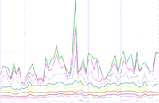

# MZBench

***Expressive, scalable load testing tool***

[](https://travis-ci.org/satori-com/mzbench) [](https://gitter.im/machinezone/mzbench?utm_source=badge&utm_medium=badge&utm_campaign=pr-badge&utm_content=badge)



MZBench helps software developers benchmark and stress test their products. Testing of your product with MZBench before going to production may reduce the risk of outages under real life highload.

MZBench runs test scenarios on many machines simultaneously, maintaining millions of connections, which makes it suitable even for large scale products.

MZBench is:

 - **Cloud-aware:** MZBench can allocates nodes directly from Amazon EC2 or run on a local machine.
 - **Scalable:** tested with 100 nodes and millions of connections.
 - **Extendable:** write your own [cloud plugins](doc/cloud_plugins.md#how-to-write-a-cloud-plugin) and [workers](doc/workers.md#how-to-write-a-worker).
 - **Open-source:** MZBench is released under the [BSD license](https://github.com/satori-com/mzbench/blob/master/LICENSE).

[Read the docs →](https://satori-com.github.io/mzbench)

## Protocols

Out-of-the-box it supports [HTTP](workers/http), [MySQL](workers/mysql), [PostgreSQL](workers/pgsql), [MongoDB](workers/mongo), [Cassandra](workers/cassandra), [XMPP](workers/xmpp), [AMQP](workers/amqp), [TCP](workers/tcp), [Shell commands execution](workers/exec), [Simplified HTTP](workers/simple_http), and [TCPKali](workers/tcpkali).

Implementing addtional protocols is [not that hard](doc/workers.md#how-to-write-a-worker), but if you want something particular to be implemented — feel free to create an [issue](https://github.com/satori-com/mzbench/issues).

## Installation

### From RPM and Pip

Available for CentOS 7 and Amazon Linux.

Download MZBench RPM from [Github releases page](https://github.com/satori-com/mzbench/releases)

```bash
# Install RPM
sudo yum install -y <rpm_file_downloaded_from_github_releases>

# Install Python package
sudo pip install mzbench_api_client

# Start the server
mzbench start_server
```

### From Docker container

Docker is a container platform, more information is available at its [website](https://www.docker.com/). If you have Docker up and running, use the following command to start MZBench server:

```bash
docker run -d -p 4800:80 --name mzbench_server docker.io/ridrisov/mzbench
```

After that, open http://localhost:4800/ to see the dashboard. Sources for this docker image are available on [github](https://github.com/satori-com/mzbench/tree/master/docker).

Instead of download the image from the docker hub, you may want to build it manually:

```bash
docker build -t mzbench -f Dockerfile .
```

### From Helm package

[Helm](https://helm.sh/) is a package manager for [Kubernetes](https://kubernetes.io/).
We assume that:
- you have Kubernetes cluster with the [Helm installed](https://docs.helm.sh/using_helm/#install-helm)
- [kubectl](https://kubernetes.io/docs/reference/kubectl/overview/) (Kubernetes cli) is configured on the local machine
- [helm cli is installed](https://docs.helm.sh/using_helm/#installing-the-helm-client) on the local machine

Given that you can install mzbench in k8s with the command

    helm install --name mzbench-server deployment/helm/mzbench

### From sources

To use MZBench, you'll need:

 - Erlang R17+
 - C++ compiler
 - Python 2.6 or 2.7 with pip

Download MZBench from GitHub and install Python requirements:

```bash
$ git clone https://github.com/satori-com/mzbench
$ sudo pip install -r mzbench/requirements.txt
```

If you want to use virtualenv (optional) to isolate Python dependencies:

```bash
$ git clone https://github.com/satori-com/mzbench
$ cd mzbench
$ virtualenv venv
$ source venv/bin/activate
$ pip install -r requirements.txt
```

## Quickstart

Start the MZBench server on localhost:

```bash
$ cd mzbench
$ ./bin/mzbench start_server
Executing make -C /path/to//mzbench/bin/../server generate
Executing /path/to//mzbench/bin/../server/_build/default/rel/mzbench_api/bin/mzbench_api start
```

When the server is running, launch an example benchmark:

```bash
$ ./bin/mzbench run examples.bdl/ramp.bdl
{
    "status": "pending",
    "id": 6
}
status: running                       00:09
```

Go to [localhost:4800](http://localhost:4800) and see the benchmark live status:


## Read Next

 - [How to write scenarios →](doc/scenarios/spec.md)
 - [How to control MZBench from command line →](doc/cli.md)
 - [How to use MZBench dashboard →](doc/dashboard.md)
 - [How to deploy MZBench →](doc/deployment.md)
 - [How to write your own worker →](doc/workers.md#how-to-write-a-worker)
