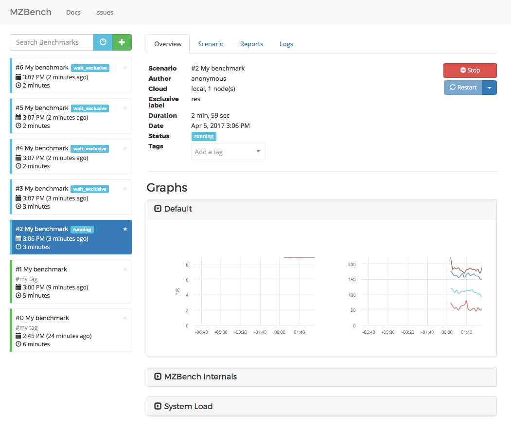
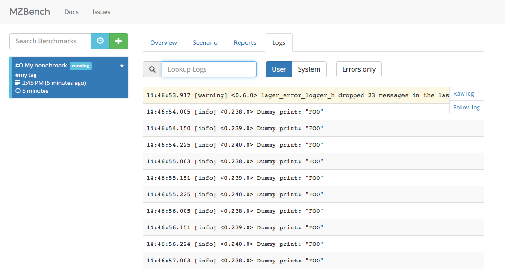
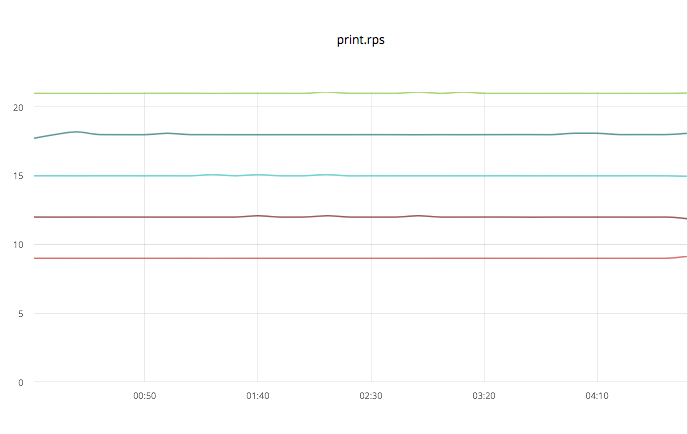
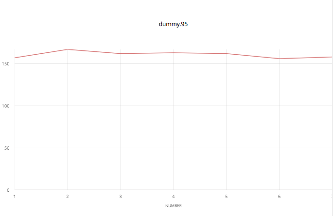
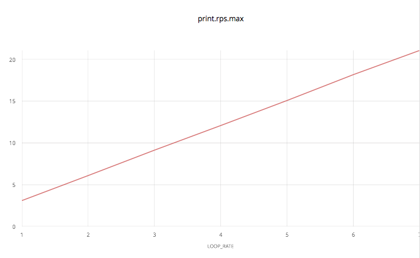

# Starting a benchmark

To start a new benchmark, press green "+" button at the left top, type your
scenario and press green "run" at the right bottom.

# Execution flow

Once benchmark is started it goes through different phases: node allocation,
provisioning, script upload, etc. If exclusive label was specified, it will
wait until no other benchmarks with the same label will be in progress. In this
case, it will be identified as "wait_exclusive".

When "running" phase begins,
you will see charts. There are two built-in groups "System load" and
"MZBench internals", the rest of the charts are worker-specific.

While benchmark is running it is possible to adjust environmental variables or
execute some code on a given percentage of workers.

Logs are available all the time.

# Comparison

If you need to compare a set of benchmarks you could use "dashboards"
functionality. Dashboard mode switch is close to new benchmark green "+".

You need to set a search criteria for your set of comparable dashboards,
if you don't have it, you could always set some unique tag for this set and
specify this tag as a criteria.

There are three kinds of charts for comparison.

`compare` -- lines from different benchmarks are shown at the same time.

`regression` -- bench number or time is X and metric value is Y.

`xychart` -- env variable is X and metric value is Y.

New data on these dashboards appear as soon as bench finishes.
